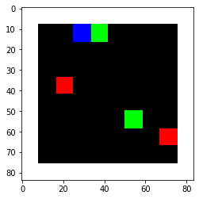
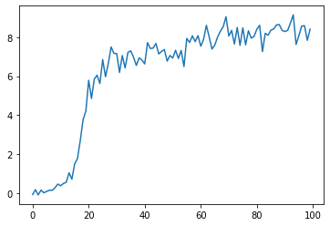

```python
#!/usr/bin/env python
# coding: utf-8

# # Simple Reinforcement Learning with Tensorflow Part 4: Deep Q-Networks and Beyond
# 
# In this iPython notebook I implement a Deep Q-Network using both Double DQN and Dueling DQN. The agent learn to solve a navigation task in a basic grid world. To learn more, read here: https://medium.com/p/8438a3e2b8df
# 
# For more reinforcment learning tutorials, see:
# https://github.com/awjuliani/DeepRL-Agents

# In[1]:


from __future__ import division

import gym
import numpy as np
import random
import tensorflow as tf
import tensorflow.contrib.slim as slim
import matplotlib.pyplot as plt
import scipy.misc
import os
#get_ipython().run_line_magic('matplotlib', 'inline')


# ### Load the game environment

# Feel free to adjust the size of the gridworld. Making it smaller provides an easier task for our DQN agent, while making the world larger increases the challenge.

# In[2]:


```

    /home/fora/anaconda3/envs/RL_test/lib/python3.6/site-packages/tensorflow/python/framework/dtypes.py:516: FutureWarning: Passing (type, 1) or '1type' as a synonym of type is deprecated; in a future version of numpy, it will be understood as (type, (1,)) / '(1,)type'.
      _np_qint8 = np.dtype([("qint8", np.int8, 1)])
    /home/fora/anaconda3/envs/RL_test/lib/python3.6/site-packages/tensorflow/python/framework/dtypes.py:517: FutureWarning: Passing (type, 1) or '1type' as a synonym of type is deprecated; in a future version of numpy, it will be understood as (type, (1,)) / '(1,)type'.
      _np_quint8 = np.dtype([("quint8", np.uint8, 1)])
    /home/fora/anaconda3/envs/RL_test/lib/python3.6/site-packages/tensorflow/python/framework/dtypes.py:518: FutureWarning: Passing (type, 1) or '1type' as a synonym of type is deprecated; in a future version of numpy, it will be understood as (type, (1,)) / '(1,)type'.
      _np_qint16 = np.dtype([("qint16", np.int16, 1)])
    /home/fora/anaconda3/envs/RL_test/lib/python3.6/site-packages/tensorflow/python/framework/dtypes.py:519: FutureWarning: Passing (type, 1) or '1type' as a synonym of type is deprecated; in a future version of numpy, it will be understood as (type, (1,)) / '(1,)type'.
      _np_quint16 = np.dtype([("quint16", np.uint16, 1)])
    /home/fora/anaconda3/envs/RL_test/lib/python3.6/site-packages/tensorflow/python/framework/dtypes.py:520: FutureWarning: Passing (type, 1) or '1type' as a synonym of type is deprecated; in a future version of numpy, it will be understood as (type, (1,)) / '(1,)type'.
      _np_qint32 = np.dtype([("qint32", np.int32, 1)])
    /home/fora/anaconda3/envs/RL_test/lib/python3.6/site-packages/tensorflow/python/framework/dtypes.py:525: FutureWarning: Passing (type, 1) or '1type' as a synonym of type is deprecated; in a future version of numpy, it will be understood as (type, (1,)) / '(1,)type'.
      np_resource = np.dtype([("resource", np.ubyte, 1)])
    /home/fora/anaconda3/envs/RL_test/lib/python3.6/site-packages/tensorboard/compat/tensorflow_stub/dtypes.py:541: FutureWarning: Passing (type, 1) or '1type' as a synonym of type is deprecated; in a future version of numpy, it will be understood as (type, (1,)) / '(1,)type'.
      _np_qint8 = np.dtype([("qint8", np.int8, 1)])
    /home/fora/anaconda3/envs/RL_test/lib/python3.6/site-packages/tensorboard/compat/tensorflow_stub/dtypes.py:542: FutureWarning: Passing (type, 1) or '1type' as a synonym of type is deprecated; in a future version of numpy, it will be understood as (type, (1,)) / '(1,)type'.
      _np_quint8 = np.dtype([("quint8", np.uint8, 1)])
    /home/fora/anaconda3/envs/RL_test/lib/python3.6/site-packages/tensorboard/compat/tensorflow_stub/dtypes.py:543: FutureWarning: Passing (type, 1) or '1type' as a synonym of type is deprecated; in a future version of numpy, it will be understood as (type, (1,)) / '(1,)type'.
      _np_qint16 = np.dtype([("qint16", np.int16, 1)])
    /home/fora/anaconda3/envs/RL_test/lib/python3.6/site-packages/tensorboard/compat/tensorflow_stub/dtypes.py:544: FutureWarning: Passing (type, 1) or '1type' as a synonym of type is deprecated; in a future version of numpy, it will be understood as (type, (1,)) / '(1,)type'.
      _np_quint16 = np.dtype([("quint16", np.uint16, 1)])
    /home/fora/anaconda3/envs/RL_test/lib/python3.6/site-packages/tensorboard/compat/tensorflow_stub/dtypes.py:545: FutureWarning: Passing (type, 1) or '1type' as a synonym of type is deprecated; in a future version of numpy, it will be understood as (type, (1,)) / '(1,)type'.
      _np_qint32 = np.dtype([("qint32", np.int32, 1)])
    /home/fora/anaconda3/envs/RL_test/lib/python3.6/site-packages/tensorboard/compat/tensorflow_stub/dtypes.py:550: FutureWarning: Passing (type, 1) or '1type' as a synonym of type is deprecated; in a future version of numpy, it will be understood as (type, (1,)) / '(1,)type'.
      np_resource = np.dtype([("resource", np.ubyte, 1)])


```python
from gridworld import gameEnv

env = gameEnv(partial=False,size=8)
```





```python
class Qnetwork():
    def __init__(self,h_size):
        #The network recieves a frame from the game, flattened into an array.
        #It then resizes it and processes it through four convolutional layers.
        self.scalarInput =  tf.placeholder(shape=[None,21168],dtype=tf.float32)
        self.imageIn = tf.reshape(self.scalarInput,shape=[-1,84,84,3])
        self.conv1 = slim.conv2d( \
            inputs=self.imageIn,num_outputs=32,kernel_size=[8,8],stride=[4,4],padding='VALID', biases_initializer=None)
        self.conv2 = slim.conv2d( \
            inputs=self.conv1,num_outputs=64,kernel_size=[4,4],stride=[2,2],padding='VALID', biases_initializer=None)
        self.conv3 = slim.conv2d( \
            inputs=self.conv2,num_outputs=64,kernel_size=[3,3],stride=[1,1],padding='VALID', biases_initializer=None)
        self.conv4 = slim.conv2d( \
            inputs=self.conv3,num_outputs=h_size,kernel_size=[7,7],stride=[1,1],padding='VALID', biases_initializer=None)
        
        #We take the output from the final convolutional layer and split it into separate advantage and value streams.
        self.streamAC,self.streamVC = tf.split(self.conv4,2,3)
        self.streamA = slim.flatten(self.streamAC)
        self.streamV = slim.flatten(self.streamVC)
        xavier_init = tf.contrib.layers.xavier_initializer()
        self.AW = tf.Variable(xavier_init([h_size//2,env.actions]))
        self.VW = tf.Variable(xavier_init([h_size//2,1]))
        self.Advantage = tf.matmul(self.streamA,self.AW)
        self.Value = tf.matmul(self.streamV,self.VW)
        
        #Then combine them together to get our final Q-values.
        self.Qout = self.Value + tf.subtract(self.Advantage,tf.reduce_mean(self.Advantage,axis=1,keep_dims=True))
        self.predict = tf.argmax(self.Qout,1)
        
        #Below we obtain the loss by taking the sum of squares difference between the target and prediction Q values.
        self.targetQ = tf.placeholder(shape=[None],dtype=tf.float32)
        self.actions = tf.placeholder(shape=[None],dtype=tf.int32)
        self.actions_onehot = tf.one_hot(self.actions,env.actions,dtype=tf.float32)
        
        self.Q = tf.reduce_sum(tf.multiply(self.Qout, self.actions_onehot), axis=1)
        
        self.td_error = tf.square(self.targetQ - self.Q)
        self.loss = tf.reduce_mean(self.td_error)
        self.trainer = tf.train.AdamOptimizer(learning_rate=0.0001)
        self.updateModel = self.trainer.minimize(self.loss)
```


```python
class experience_buffer():
    def __init__(self, buffer_size = 50000):
        self.buffer = []
        self.buffer_size = buffer_size
    
    def add(self,experience):
        if len(self.buffer) + len(experience) >= self.buffer_size:
            self.buffer[0:(len(experience)+len(self.buffer))-self.buffer_size] = []
        self.buffer.extend(experience)
            
    def sample(self,size):
        return np.reshape(np.array(random.sample(self.buffer,size)),[size,5])
```


```python
def processState(states):
    return np.reshape(states,[21168])
```


```python
def updateTargetGraph(tfVars,tau):
    total_vars = len(tfVars)
    op_holder = []
    for idx,var in enumerate(tfVars[0:total_vars//2]):
        op_holder.append(tfVars[idx+total_vars//2].assign((var.value()*tau) + ((1-tau)*tfVars[idx+total_vars//2].value())))
    return op_holder

def updateTarget(op_holder,sess):
    for op in op_holder:
        sess.run(op)
```


```python
batch_size = 32 #How many experiences to use for each training step.
update_freq = 4 #How often to perform a training step.
y = .99 #Discount factor on the target Q-values
startE = 1 #Starting chance of random action
endE = 0.1 #Final chance of random action
annealing_steps = 10000. #How many steps of training to reduce startE to endE.
num_episodes = 10000 #How many episodes of game environment to train network with.
pre_train_steps = 10000 #How many steps of random actions before training begins.
max_epLength = 50 #The max allowed length of our episode.
load_model = False #Whether to load a saved model.
path = "./dqn" #The path to save our model to.
h_size = 512 #The size of the final convolutional layer before splitting it into Advantage and Value streams.
tau = 0.001 #Rate to update target network toward primary network
```


```python
tf.reset_default_graph()
mainQN = Qnetwork(h_size)
targetQN = Qnetwork(h_size)

init = tf.global_variables_initializer()

saver = tf.train.Saver()

trainables = tf.trainable_variables()

targetOps = updateTargetGraph(trainables,tau)

myBuffer = experience_buffer()

#Set the rate of random action decrease. 
e = startE
stepDrop = (startE - endE)/annealing_steps

#create lists to contain total rewards and steps per episode
jList = []
rList = []
total_steps = 0

#Make a path for our model to be saved in.
if not os.path.exists(path):
    os.makedirs(path)

with tf.Session() as sess:
    sess.run(init)
    if load_model == True:
        print('Loading Model...')
        ckpt = tf.train.get_checkpoint_state(path)
        saver.restore(sess,ckpt.model_checkpoint_path)
    for i in range(num_episodes):
        episodeBuffer = experience_buffer()
        #Reset environment and get first new observation
        s = env.reset()
        s = processState(s)
        d = False
        rAll = 0
        j = 0
        #The Q-Network
        while j < max_epLength: #If the agent takes longer than 200 moves to reach either of the blocks, end the trial.
            j+=1
            #Choose an action by greedily (with e chance of random action) from the Q-network
            if np.random.rand(1) < e or total_steps < pre_train_steps:
                a = np.random.randint(0,4)
            else:
                a = sess.run(mainQN.predict,feed_dict={mainQN.scalarInput:[s]})[0]
            s1,r,d = env.step(a)
            s1 = processState(s1)
            total_steps += 1
            episodeBuffer.add(np.reshape(np.array([s,a,r,s1,d]),[1,5])) #Save the experience to our episode buffer.
            
            if total_steps > pre_train_steps:
                if e > endE:
                    e -= stepDrop
                
                if total_steps % (update_freq) == 0:
                    trainBatch = myBuffer.sample(batch_size) #Get a random batch of experiences.
                    #Below we perform the Double-DQN update to the target Q-values
                    Q1 = sess.run(mainQN.predict,feed_dict={mainQN.scalarInput:np.vstack(trainBatch[:,3])})
                    Q2 = sess.run(targetQN.Qout,feed_dict={targetQN.scalarInput:np.vstack(trainBatch[:,3])})
                    end_multiplier = -(trainBatch[:,4] - 1)
                    doubleQ = Q2[range(batch_size),Q1]
                    targetQ = trainBatch[:,2] + (y*doubleQ * end_multiplier)
                    #Update the network with our target values.
                    _ = sess.run(mainQN.updateModel, \
                        feed_dict={mainQN.scalarInput:np.vstack(trainBatch[:,0]),mainQN.targetQ:targetQ, mainQN.actions:trainBatch[:,1]})
                    
                    updateTarget(targetOps,sess) #Update the target network toward the primary network.
            rAll += r
            s = s1
            
            if d == True:

                break
        
        myBuffer.add(episodeBuffer.buffer)
        jList.append(j)
        rList.append(rAll)
        #Periodically save the model. 
        if i % 1000 == 0:
            saver.save(sess,path+'/model-'+str(i)+'.ckpt')
            print("Saved Model")
        if len(rList) % 10 == 0:
            print(total_steps,np.mean(rList[-10:]), e)
    saver.save(sess,path+'/model-'+str(i)+'.ckpt')
print("Percent of succesful episodes: " + str(sum(rList)/num_episodes) + "%")
```

    WARNING:tensorflow:Entity <bound method Conv.call of <tensorflow.python.layers.convolutional.Conv2D object at 0x7f0c55aaa518>> could not be transformed and will be executed as-is. Please report this to the AutgoGraph team. When filing the bug, set the verbosity to 10 (on Linux, `export AUTOGRAPH_VERBOSITY=10`) and attach the full output. Cause: converting <bound method Conv.call of <tensorflow.python.layers.convolutional.Conv2D object at 0x7f0c55aaa518>>: AssertionError: Bad argument number for Name: 3, expecting 4
    WARNING: Entity <bound method Conv.call of <tensorflow.python.layers.convolutional.Conv2D object at 0x7f0c55aaa518>> could not be transformed and will be executed as-is. Please report this to the AutgoGraph team. When filing the bug, set the verbosity to 10 (on Linux, `export AUTOGRAPH_VERBOSITY=10`) and attach the full output. Cause: converting <bound method Conv.call of <tensorflow.python.layers.convolutional.Conv2D object at 0x7f0c55aaa518>>: AssertionError: Bad argument number for Name: 3, expecting 4
    WARNING:tensorflow:Entity <bound method Conv.call of <tensorflow.python.layers.convolutional.Conv2D object at 0x7f0c55aaa198>> could not be transformed and will be executed as-is. Please report this to the AutgoGraph team. When filing the bug, set the verbosity to 10 (on Linux, `export AUTOGRAPH_VERBOSITY=10`) and attach the full output. Cause: converting <bound method Conv.call of <tensorflow.python.layers.convolutional.Conv2D object at 0x7f0c55aaa198>>: AssertionError: Bad argument number for Name: 3, expecting 4
    WARNING: Entity <bound method Conv.call of <tensorflow.python.layers.convolutional.Conv2D object at 0x7f0c55aaa198>> could not be transformed and will be executed as-is. Please report this to the AutgoGraph team. When filing the bug, set the verbosity to 10 (on Linux, `export AUTOGRAPH_VERBOSITY=10`) and attach the full output. Cause: converting <bound method Conv.call of <tensorflow.python.layers.convolutional.Conv2D object at 0x7f0c55aaa198>>: AssertionError: Bad argument number for Name: 3, expecting 4
    WARNING:tensorflow:Entity <bound method Conv.call of <tensorflow.python.layers.convolutional.Conv2D object at 0x7f0c55aaa780>> could not be transformed and will be executed as-is. Please report this to the AutgoGraph team. When filing the bug, set the verbosity to 10 (on Linux, `export AUTOGRAPH_VERBOSITY=10`) and attach the full output. Cause: converting <bound method Conv.call of <tensorflow.python.layers.convolutional.Conv2D object at 0x7f0c55aaa780>>: AssertionError: Bad argument number for Name: 3, expecting 4
    WARNING: Entity <bound method Conv.call of <tensorflow.python.layers.convolutional.Conv2D object at 0x7f0c55aaa780>> could not be transformed and will be executed as-is. Please report this to the AutgoGraph team. When filing the bug, set the verbosity to 10 (on Linux, `export AUTOGRAPH_VERBOSITY=10`) and attach the full output. Cause: converting <bound method Conv.call of <tensorflow.python.layers.convolutional.Conv2D object at 0x7f0c55aaa780>>: AssertionError: Bad argument number for Name: 3, expecting 4
    WARNING:tensorflow:Entity <bound method Conv.call of <tensorflow.python.layers.convolutional.Conv2D object at 0x7f0c55aaa860>> could not be transformed and will be executed as-is. Please report this to the AutgoGraph team. When filing the bug, set the verbosity to 10 (on Linux, `export AUTOGRAPH_VERBOSITY=10`) and attach the full output. Cause: converting <bound method Conv.call of <tensorflow.python.layers.convolutional.Conv2D object at 0x7f0c55aaa860>>: AssertionError: Bad argument number for Name: 3, expecting 4
    WARNING: Entity <bound method Conv.call of <tensorflow.python.layers.convolutional.Conv2D object at 0x7f0c55aaa860>> could not be transformed and will be executed as-is. Please report this to the AutgoGraph team. When filing the bug, set the verbosity to 10 (on Linux, `export AUTOGRAPH_VERBOSITY=10`) and attach the full output. Cause: converting <bound method Conv.call of <tensorflow.python.layers.convolutional.Conv2D object at 0x7f0c55aaa860>>: AssertionError: Bad argument number for Name: 3, expecting 4
    WARNING:tensorflow:From /home/fora/anaconda3/envs/RL_test/lib/python3.6/site-packages/tensorflow/contrib/layers/python/layers/layers.py:1634: flatten (from tensorflow.python.layers.core) is deprecated and will be removed in a future version.
    Instructions for updating:
    Use keras.layers.flatten instead.
    WARNING:tensorflow:Entity <bound method Flatten.call of <tensorflow.python.layers.core.Flatten object at 0x7f0c55aaa780>> could not be transformed and will be executed as-is. Please report this to the AutgoGraph team. When filing the bug, set the verbosity to 10 (on Linux, `export AUTOGRAPH_VERBOSITY=10`) and attach the full output. Cause: converting <bound method Flatten.call of <tensorflow.python.layers.core.Flatten object at 0x7f0c55aaa780>>: AttributeError: module 'gast' has no attribute 'Num'
    WARNING: Entity <bound method Flatten.call of <tensorflow.python.layers.core.Flatten object at 0x7f0c55aaa780>> could not be transformed and will be executed as-is. Please report this to the AutgoGraph team. When filing the bug, set the verbosity to 10 (on Linux, `export AUTOGRAPH_VERBOSITY=10`) and attach the full output. Cause: converting <bound method Flatten.call of <tensorflow.python.layers.core.Flatten object at 0x7f0c55aaa780>>: AttributeError: module 'gast' has no attribute 'Num'
    WARNING:tensorflow:Entity <bound method Flatten.call of <tensorflow.python.layers.core.Flatten object at 0x7f0c55aaa780>> could not be transformed and will be executed as-is. Please report this to the AutgoGraph team. When filing the bug, set the verbosity to 10 (on Linux, `export AUTOGRAPH_VERBOSITY=10`) and attach the full output. Cause: converting <bound method Flatten.call of <tensorflow.python.layers.core.Flatten object at 0x7f0c55aaa780>>: AttributeError: module 'gast' has no attribute 'Num'
    WARNING: Entity <bound method Flatten.call of <tensorflow.python.layers.core.Flatten object at 0x7f0c55aaa780>> could not be transformed and will be executed as-is. Please report this to the AutgoGraph team. When filing the bug, set the verbosity to 10 (on Linux, `export AUTOGRAPH_VERBOSITY=10`) and attach the full output. Cause: converting <bound method Flatten.call of <tensorflow.python.layers.core.Flatten object at 0x7f0c55aaa780>>: AttributeError: module 'gast' has no attribute 'Num'
    WARNING:tensorflow:Entity <bound method Conv.call of <tensorflow.python.layers.convolutional.Conv2D object at 0x7f0c550935f8>> could not be transformed and will be executed as-is. Please report this to the AutgoGraph team. When filing the bug, set the verbosity to 10 (on Linux, `export AUTOGRAPH_VERBOSITY=10`) and attach the full output. Cause: converting <bound method Conv.call of <tensorflow.python.layers.convolutional.Conv2D object at 0x7f0c550935f8>>: AssertionError: Bad argument number for Name: 3, expecting 4
    WARNING: Entity <bound method Conv.call of <tensorflow.python.layers.convolutional.Conv2D object at 0x7f0c550935f8>> could not be transformed and will be executed as-is. Please report this to the AutgoGraph team. When filing the bug, set the verbosity to 10 (on Linux, `export AUTOGRAPH_VERBOSITY=10`) and attach the full output. Cause: converting <bound method Conv.call of <tensorflow.python.layers.convolutional.Conv2D object at 0x7f0c550935f8>>: AssertionError: Bad argument number for Name: 3, expecting 4
    WARNING:tensorflow:Entity <bound method Conv.call of <tensorflow.python.layers.convolutional.Conv2D object at 0x7f0c55fcb518>> could not be transformed and will be executed as-is. Please report this to the AutgoGraph team. When filing the bug, set the verbosity to 10 (on Linux, `export AUTOGRAPH_VERBOSITY=10`) and attach the full output. Cause: converting <bound method Conv.call of <tensorflow.python.layers.convolutional.Conv2D object at 0x7f0c55fcb518>>: AssertionError: Bad argument number for Name: 3, expecting 4
    WARNING: Entity <bound method Conv.call of <tensorflow.python.layers.convolutional.Conv2D object at 0x7f0c55fcb518>> could not be transformed and will be executed as-is. Please report this to the AutgoGraph team. When filing the bug, set the verbosity to 10 (on Linux, `export AUTOGRAPH_VERBOSITY=10`) and attach the full output. Cause: converting <bound method Conv.call of <tensorflow.python.layers.convolutional.Conv2D object at 0x7f0c55fcb518>>: AssertionError: Bad argument number for Name: 3, expecting 4
    WARNING:tensorflow:Entity <bound method Conv.call of <tensorflow.python.layers.convolutional.Conv2D object at 0x7f0c54fd87b8>> could not be transformed and will be executed as-is. Please report this to the AutgoGraph team. When filing the bug, set the verbosity to 10 (on Linux, `export AUTOGRAPH_VERBOSITY=10`) and attach the full output. Cause: converting <bound method Conv.call of <tensorflow.python.layers.convolutional.Conv2D object at 0x7f0c54fd87b8>>: AssertionError: Bad argument number for Name: 3, expecting 4
    WARNING: Entity <bound method Conv.call of <tensorflow.python.layers.convolutional.Conv2D object at 0x7f0c54fd87b8>> could not be transformed and will be executed as-is. Please report this to the AutgoGraph team. When filing the bug, set the verbosity to 10 (on Linux, `export AUTOGRAPH_VERBOSITY=10`) and attach the full output. Cause: converting <bound method Conv.call of <tensorflow.python.layers.convolutional.Conv2D object at 0x7f0c54fd87b8>>: AssertionError: Bad argument number for Name: 3, expecting 4
    WARNING:tensorflow:Entity <bound method Conv.call of <tensorflow.python.layers.convolutional.Conv2D object at 0x7f0c54f6c048>> could not be transformed and will be executed as-is. Please report this to the AutgoGraph team. When filing the bug, set the verbosity to 10 (on Linux, `export AUTOGRAPH_VERBOSITY=10`) and attach the full output. Cause: converting <bound method Conv.call of <tensorflow.python.layers.convolutional.Conv2D object at 0x7f0c54f6c048>>: AssertionError: Bad argument number for Name: 3, expecting 4
    WARNING: Entity <bound method Conv.call of <tensorflow.python.layers.convolutional.Conv2D object at 0x7f0c54f6c048>> could not be transformed and will be executed as-is. Please report this to the AutgoGraph team. When filing the bug, set the verbosity to 10 (on Linux, `export AUTOGRAPH_VERBOSITY=10`) and attach the full output. Cause: converting <bound method Conv.call of <tensorflow.python.layers.convolutional.Conv2D object at 0x7f0c54f6c048>>: AssertionError: Bad argument number for Name: 3, expecting 4
    WARNING:tensorflow:Entity <bound method Flatten.call of <tensorflow.python.layers.core.Flatten object at 0x7f0c54f6c748>> could not be transformed and will be executed as-is. Please report this to the AutgoGraph team. When filing the bug, set the verbosity to 10 (on Linux, `export AUTOGRAPH_VERBOSITY=10`) and attach the full output. Cause: converting <bound method Flatten.call of <tensorflow.python.layers.core.Flatten object at 0x7f0c54f6c748>>: AttributeError: module 'gast' has no attribute 'Num'
    WARNING: Entity <bound method Flatten.call of <tensorflow.python.layers.core.Flatten object at 0x7f0c54f6c748>> could not be transformed and will be executed as-is. Please report this to the AutgoGraph team. When filing the bug, set the verbosity to 10 (on Linux, `export AUTOGRAPH_VERBOSITY=10`) and attach the full output. Cause: converting <bound method Flatten.call of <tensorflow.python.layers.core.Flatten object at 0x7f0c54f6c748>>: AttributeError: module 'gast' has no attribute 'Num'
    WARNING:tensorflow:Entity <bound method Flatten.call of <tensorflow.python.layers.core.Flatten object at 0x7f0c54f6c748>> could not be transformed and will be executed as-is. Please report this to the AutgoGraph team. When filing the bug, set the verbosity to 10 (on Linux, `export AUTOGRAPH_VERBOSITY=10`) and attach the full output. Cause: converting <bound method Flatten.call of <tensorflow.python.layers.core.Flatten object at 0x7f0c54f6c748>>: AttributeError: module 'gast' has no attribute 'Num'
    WARNING: Entity <bound method Flatten.call of <tensorflow.python.layers.core.Flatten object at 0x7f0c54f6c748>> could not be transformed and will be executed as-is. Please report this to the AutgoGraph team. When filing the bug, set the verbosity to 10 (on Linux, `export AUTOGRAPH_VERBOSITY=10`) and attach the full output. Cause: converting <bound method Flatten.call of <tensorflow.python.layers.core.Flatten object at 0x7f0c54f6c748>>: AttributeError: module 'gast' has no attribute 'Num'
    Saved Model
    500 -0.8 1
    1000 -0.1 1
    1500 -0.1 1
    2000 0.0 1
    2500 0.4 1
    3000 -0.2 1
    3500 0.1 1
    4000 0.5 1
    4500 -0.5 1
    5000 -0.1 1
    5500 0.8 1
    6000 0.3 1
    6500 0.3 1
    7000 0.1 1
    7500 -0.9 1
    8000 -0.1 1
    8500 0.0 1
    9000 0.1 1
    9500 0.5 1
    10000 0.6 1
    10500 -0.7 0.9549999999999828
    11000 0.1 0.9099999999999655
    11500 0.7 0.8649999999999483
    12000 0.2 0.819999999999931
    12500 0.0 0.7749999999999138
    13000 -0.2 0.7299999999998965
    13500 0.0 0.6849999999998793
    14000 -0.7 0.639999999999862
    14500 -0.2 0.5949999999998448
    15000 -0.2 0.5499999999998275
    15500 0.2 0.5049999999998103
    16000 0.6 0.4599999999998177
    16500 0.3 0.41499999999982823
    17000 0.5 0.36999999999983874
    17500 0.1 0.32499999999984924
    18000 0.2 0.27999999999985975
    18500 0.0 0.23499999999986562
    19000 -0.5 0.18999999999986225
    19500 0.2 0.14499999999985888
    20000 -0.1 0.09999999999985551
    20500 0.4 0.09999999999985551
    21000 -0.3 0.09999999999985551
    21500 -0.4 0.09999999999985551
    22000 0.1 0.09999999999985551
    22500 0.0 0.09999999999985551
    23000 0.4 0.09999999999985551
    23500 0.2 0.09999999999985551
    24000 0.2 0.09999999999985551
    24500 -0.6 0.09999999999985551
    25000 0.1 0.09999999999985551
    25500 0.2 0.09999999999985551
    26000 0.2 0.09999999999985551
    26500 0.2 0.09999999999985551
    27000 -0.3 0.09999999999985551
    27500 -0.1 0.09999999999985551
    28000 -0.1 0.09999999999985551
    28500 0.3 0.09999999999985551
    29000 -0.2 0.09999999999985551
    29500 0.4 0.09999999999985551
    30000 0.2 0.09999999999985551
    30500 0.1 0.09999999999985551
    31000 0.1 0.09999999999985551
    31500 0.0 0.09999999999985551
    32000 0.1 0.09999999999985551
    32500 0.1 0.09999999999985551
    33000 0.3 0.09999999999985551
    33500 0.2 0.09999999999985551
    34000 0.1 0.09999999999985551
    34500 0.3 0.09999999999985551
    35000 0.1 0.09999999999985551
    35500 0.0 0.09999999999985551
    36000 0.3 0.09999999999985551
    36500 -0.3 0.09999999999985551
    37000 0.5 0.09999999999985551
    37500 0.2 0.09999999999985551
    38000 0.1 0.09999999999985551
    38500 0.1 0.09999999999985551
    39000 0.2 0.09999999999985551
    39500 0.0 0.09999999999985551
    40000 0.3 0.09999999999985551
    40500 -0.1 0.09999999999985551
    41000 0.2 0.09999999999985551
    41500 0.3 0.09999999999985551
    42000 0.3 0.09999999999985551
    42500 0.4 0.09999999999985551
    43000 0.5 0.09999999999985551
    43500 0.5 0.09999999999985551
    44000 0.4 0.09999999999985551
    44500 0.1 0.09999999999985551
    45000 0.1 0.09999999999985551
    45500 0.4 0.09999999999985551
    46000 0.2 0.09999999999985551
    46500 0.2 0.09999999999985551
    47000 0.2 0.09999999999985551
    47500 0.0 0.09999999999985551
    48000 0.5 0.09999999999985551
    48500 1.0 0.09999999999985551
    49000 0.9 0.09999999999985551
    49500 0.9 0.09999999999985551
    50000 0.3 0.09999999999985551
    Saved Model
    50500 0.2 0.09999999999985551
    51000 0.3 0.09999999999985551
    51500 0.8 0.09999999999985551
    52000 0.7 0.09999999999985551
    52500 0.2 0.09999999999985551
    53000 0.6 0.09999999999985551
    53500 0.2 0.09999999999985551
    54000 0.2 0.09999999999985551
    54500 0.2 0.09999999999985551
    55000 0.3 0.09999999999985551
    55500 0.1 0.09999999999985551
    56000 0.5 0.09999999999985551
    56500 0.5 0.09999999999985551
    57000 0.3 0.09999999999985551
    57500 1.0 0.09999999999985551
    58000 0.8 0.09999999999985551
    58500 0.5 0.09999999999985551
    59000 0.8 0.09999999999985551
    59500 0.3 0.09999999999985551
    60000 0.1 0.09999999999985551
    60500 0.4 0.09999999999985551
    61000 0.2 0.09999999999985551
    61500 0.4 0.09999999999985551
    62000 0.6 0.09999999999985551
    62500 1.3 0.09999999999985551
    63000 0.2 0.09999999999985551
    63500 0.6 0.09999999999985551
    64000 -0.1 0.09999999999985551
    64500 0.7 0.09999999999985551
    65000 1.2 0.09999999999985551
    65500 0.9 0.09999999999985551
    66000 0.7 0.09999999999985551
    66500 1.0 0.09999999999985551
    67000 0.9 0.09999999999985551
    67500 1.0 0.09999999999985551
    68000 1.1 0.09999999999985551
    68500 0.8 0.09999999999985551
    69000 1.5 0.09999999999985551
    69500 1.1 0.09999999999985551
    70000 1.4 0.09999999999985551
    70500 0.8 0.09999999999985551
    71000 1.0 0.09999999999985551
    71500 0.4 0.09999999999985551
    72000 0.8 0.09999999999985551
    72500 0.8 0.09999999999985551
    73000 0.9 0.09999999999985551
    73500 0.4 0.09999999999985551
    74000 0.4 0.09999999999985551
    74500 1.1 0.09999999999985551
    75000 0.5 0.09999999999985551
    75500 1.3 0.09999999999985551
    76000 0.3 0.09999999999985551
    76500 1.7 0.09999999999985551
    77000 2.1 0.09999999999985551
    77500 1.8 0.09999999999985551
    78000 0.7 0.09999999999985551
    78500 1.6 0.09999999999985551
    79000 1.5 0.09999999999985551
    79500 2.4 0.09999999999985551
    80000 1.5 0.09999999999985551
    80500 1.7 0.09999999999985551
    81000 1.5 0.09999999999985551
    81500 2.7 0.09999999999985551
    82000 1.7 0.09999999999985551
    82500 1.4 0.09999999999985551
    83000 0.7 0.09999999999985551
    83500 2.2 0.09999999999985551
    84000 1.8 0.09999999999985551
    84500 1.9 0.09999999999985551
    85000 2.1 0.09999999999985551
    85500 4.0 0.09999999999985551
    86000 3.3 0.09999999999985551
    86500 2.7 0.09999999999985551
    87000 1.3 0.09999999999985551
    87500 2.8 0.09999999999985551
    88000 2.2 0.09999999999985551
    88500 2.7 0.09999999999985551
    89000 3.2 0.09999999999985551
    89500 1.8 0.09999999999985551
    90000 2.9 0.09999999999985551
    90500 4.6 0.09999999999985551
    91000 3.5 0.09999999999985551
    91500 4.1 0.09999999999985551
    92000 3.1 0.09999999999985551
    92500 4.2 0.09999999999985551
    93000 3.9 0.09999999999985551
    93500 3.6 0.09999999999985551
    94000 3.0 0.09999999999985551
    94500 4.6 0.09999999999985551
    95000 3.1 0.09999999999985551
    95500 4.9 0.09999999999985551
    96000 2.6 0.09999999999985551
    96500 4.0 0.09999999999985551
    97000 4.3 0.09999999999985551
    97500 4.8 0.09999999999985551
    98000 4.8 0.09999999999985551
    98500 4.6 0.09999999999985551
    99000 2.6 0.09999999999985551
    99500 5.2 0.09999999999985551
    100000 4.3 0.09999999999985551
    Saved Model
    100500 6.3 0.09999999999985551
    101000 5.6 0.09999999999985551
    101500 7.4 0.09999999999985551
    102000 5.1 0.09999999999985551
    102500 3.0 0.09999999999985551
    103000 6.0 0.09999999999985551
    103500 6.0 0.09999999999985551
    104000 5.5 0.09999999999985551
    104500 6.5 0.09999999999985551
    105000 6.5 0.09999999999985551
    105500 3.4 0.09999999999985551
    106000 3.4 0.09999999999985551
    106500 4.9 0.09999999999985551
    107000 5.1 0.09999999999985551
    107500 4.6 0.09999999999985551
    108000 6.1 0.09999999999985551
    108500 4.7 0.09999999999985551
    109000 4.7 0.09999999999985551
    109500 5.3 0.09999999999985551
    110000 6.3 0.09999999999985551
    110500 7.2 0.09999999999985551
    111000 5.6 0.09999999999985551
    111500 6.2 0.09999999999985551
    112000 4.8 0.09999999999985551
    112500 6.5 0.09999999999985551
    113000 6.1 0.09999999999985551
    113500 2.9 0.09999999999985551
    114000 7.6 0.09999999999985551
    114500 6.7 0.09999999999985551
    115000 4.9 0.09999999999985551
    115500 6.1 0.09999999999985551
    116000 5.3 0.09999999999985551
    116500 7.3 0.09999999999985551
    117000 5.0 0.09999999999985551
    117500 6.9 0.09999999999985551
    118000 6.4 0.09999999999985551
    118500 4.8 0.09999999999985551
    119000 7.4 0.09999999999985551
    119500 5.6 0.09999999999985551
    120000 5.7 0.09999999999985551
    120500 5.9 0.09999999999985551
    121000 5.6 0.09999999999985551
    121500 4.1 0.09999999999985551
    122000 5.7 0.09999999999985551
    122500 5.7 0.09999999999985551
    123000 4.3 0.09999999999985551
    123500 6.1 0.09999999999985551
    124000 4.9 0.09999999999985551
    124500 6.5 0.09999999999985551
    125000 7.4 0.09999999999985551
    125500 7.3 0.09999999999985551
    126000 6.9 0.09999999999985551
    126500 7.9 0.09999999999985551
    127000 6.3 0.09999999999985551
    127500 9.4 0.09999999999985551
    128000 6.1 0.09999999999985551
    128500 4.7 0.09999999999985551
    129000 5.5 0.09999999999985551
    129500 6.5 0.09999999999985551
    130000 7.9 0.09999999999985551
    130500 5.1 0.09999999999985551
    131000 5.9 0.09999999999985551
    131500 8.2 0.09999999999985551
    132000 5.1 0.09999999999985551
    132500 6.5 0.09999999999985551
    133000 5.8 0.09999999999985551
    133500 5.0 0.09999999999985551
    134000 5.7 0.09999999999985551
    134500 7.6 0.09999999999985551
    135000 4.8 0.09999999999985551
    135500 6.5 0.09999999999985551
    136000 5.4 0.09999999999985551
    136500 5.8 0.09999999999985551
    137000 7.1 0.09999999999985551
    137500 6.7 0.09999999999985551
    138000 6.9 0.09999999999985551
    138500 8.1 0.09999999999985551
    139000 6.2 0.09999999999985551
    139500 7.0 0.09999999999985551
    140000 6.8 0.09999999999985551
    140500 8.0 0.09999999999985551
    141000 6.1 0.09999999999985551
    141500 7.3 0.09999999999985551
    142000 7.0 0.09999999999985551
    142500 7.9 0.09999999999985551
    143000 7.3 0.09999999999985551
    143500 6.8 0.09999999999985551
    144000 8.6 0.09999999999985551
    144500 7.3 0.09999999999985551
    145000 8.7 0.09999999999985551
    145500 7.6 0.09999999999985551
    146000 8.3 0.09999999999985551
    146500 8.3 0.09999999999985551
    147000 8.0 0.09999999999985551
    147500 6.3 0.09999999999985551
    148000 6.8 0.09999999999985551
    148500 7.3 0.09999999999985551
    149000 5.9 0.09999999999985551
    149500 5.8 0.09999999999985551
    150000 7.4 0.09999999999985551
    Saved Model
    150500 6.2 0.09999999999985551
    151000 8.1 0.09999999999985551
    151500 8.0 0.09999999999985551
    152000 10.0 0.09999999999985551
    152500 6.9 0.09999999999985551
    153000 5.7 0.09999999999985551
    153500 7.0 0.09999999999985551
    154000 6.5 0.09999999999985551
    154500 8.3 0.09999999999985551
    155000 4.9 0.09999999999985551
    155500 3.1 0.09999999999985551
    156000 6.0 0.09999999999985551
    156500 3.7 0.09999999999985551
    157000 6.7 0.09999999999985551
    157500 6.4 0.09999999999985551
    158000 5.2 0.09999999999985551
    158500 7.6 0.09999999999985551
    159000 8.0 0.09999999999985551
    159500 7.2 0.09999999999985551
    160000 8.0 0.09999999999985551
    160500 7.0 0.09999999999985551
    161000 7.6 0.09999999999985551
    161500 5.6 0.09999999999985551
    162000 7.5 0.09999999999985551
    162500 6.8 0.09999999999985551
    163000 8.8 0.09999999999985551
    163500 6.8 0.09999999999985551
    164000 8.3 0.09999999999985551
    164500 4.8 0.09999999999985551
    165000 7.4 0.09999999999985551
    165500 5.6 0.09999999999985551
    166000 5.9 0.09999999999985551
    166500 7.4 0.09999999999985551
    167000 3.7 0.09999999999985551
    167500 5.9 0.09999999999985551
    168000 7.9 0.09999999999985551
    168500 6.4 0.09999999999985551
    169000 8.0 0.09999999999985551
    169500 6.5 0.09999999999985551
    170000 6.9 0.09999999999985551
    170500 6.9 0.09999999999985551
    171000 8.9 0.09999999999985551
    171500 4.9 0.09999999999985551
    172000 9.0 0.09999999999985551
    172500 5.5 0.09999999999985551
    173000 7.5 0.09999999999985551
    173500 6.2 0.09999999999985551
    174000 8.2 0.09999999999985551
    174500 7.1 0.09999999999985551
    175000 8.0 0.09999999999985551
    175500 7.0 0.09999999999985551
    176000 8.8 0.09999999999985551
    176500 6.1 0.09999999999985551
    177000 5.2 0.09999999999985551
    177500 7.9 0.09999999999985551
    178000 9.1 0.09999999999985551
    178500 8.6 0.09999999999985551
    179000 6.3 0.09999999999985551
    179500 6.6 0.09999999999985551
    180000 7.4 0.09999999999985551
    180500 5.8 0.09999999999985551
    181000 8.6 0.09999999999985551
    181500 9.5 0.09999999999985551
    182000 5.5 0.09999999999985551
    182500 7.2 0.09999999999985551
    183000 5.1 0.09999999999985551
    183500 6.6 0.09999999999985551
    184000 8.1 0.09999999999985551
    184500 8.3 0.09999999999985551
    185000 5.1 0.09999999999985551
    185500 5.3 0.09999999999985551
    186000 7.6 0.09999999999985551
    186500 5.8 0.09999999999985551
    187000 6.3 0.09999999999985551
    187500 6.5 0.09999999999985551
    188000 6.2 0.09999999999985551
    188500 7.3 0.09999999999985551
    189000 4.8 0.09999999999985551
    189500 7.6 0.09999999999985551
    190000 8.1 0.09999999999985551
    190500 6.3 0.09999999999985551
    191000 6.2 0.09999999999985551
    191500 6.2 0.09999999999985551
    192000 7.3 0.09999999999985551
    192500 7.6 0.09999999999985551
    193000 7.1 0.09999999999985551
    193500 7.5 0.09999999999985551
    194000 6.8 0.09999999999985551
    194500 8.7 0.09999999999985551
    195000 5.7 0.09999999999985551
    195500 6.3 0.09999999999985551
    196000 5.3 0.09999999999985551
    196500 7.1 0.09999999999985551
    197000 5.5 0.09999999999985551
    197500 8.7 0.09999999999985551
    198000 5.9 0.09999999999985551
    198500 6.9 0.09999999999985551
    199000 7.6 0.09999999999985551
    199500 8.3 0.09999999999985551
    200000 6.7 0.09999999999985551
    Saved Model
    200500 5.3 0.09999999999985551
    201000 4.4 0.09999999999985551
    201500 7.7 0.09999999999985551
    202000 6.2 0.09999999999985551
    202500 6.4 0.09999999999985551
    203000 7.3 0.09999999999985551
    203500 8.4 0.09999999999985551
    204000 6.4 0.09999999999985551
    204500 7.5 0.09999999999985551
    205000 6.7 0.09999999999985551
    205500 8.7 0.09999999999985551
    206000 6.6 0.09999999999985551
    206500 6.9 0.09999999999985551
    207000 7.8 0.09999999999985551
    207500 7.4 0.09999999999985551
    208000 8.1 0.09999999999985551
    208500 8.9 0.09999999999985551
    209000 7.6 0.09999999999985551
    209500 8.8 0.09999999999985551
    210000 6.4 0.09999999999985551
    210500 6.1 0.09999999999985551
    211000 5.3 0.09999999999985551
    211500 6.8 0.09999999999985551
    212000 9.0 0.09999999999985551
    212500 8.7 0.09999999999985551
    213000 8.4 0.09999999999985551
    213500 7.4 0.09999999999985551
    214000 6.9 0.09999999999985551
    214500 8.6 0.09999999999985551
    215000 7.0 0.09999999999985551
    215500 5.9 0.09999999999985551
    216000 8.1 0.09999999999985551
    216500 6.2 0.09999999999985551
    217000 6.2 0.09999999999985551
    217500 7.9 0.09999999999985551
    218000 8.0 0.09999999999985551
    218500 5.2 0.09999999999985551
    219000 9.2 0.09999999999985551
    219500 5.9 0.09999999999985551
    220000 11.8 0.09999999999985551
    220500 5.3 0.09999999999985551
    221000 7.0 0.09999999999985551
    221500 7.5 0.09999999999985551
    222000 8.4 0.09999999999985551
    222500 7.9 0.09999999999985551
    223000 8.2 0.09999999999985551
    223500 8.3 0.09999999999985551
    224000 8.7 0.09999999999985551
    224500 9.0 0.09999999999985551
    225000 6.5 0.09999999999985551
    225500 7.1 0.09999999999985551
    226000 4.4 0.09999999999985551
    226500 7.5 0.09999999999985551
    227000 7.2 0.09999999999985551
    227500 6.9 0.09999999999985551
    228000 7.5 0.09999999999985551
    228500 8.0 0.09999999999985551
    229000 7.3 0.09999999999985551
    229500 8.5 0.09999999999985551
    230000 7.0 0.09999999999985551
    230500 7.7 0.09999999999985551
    231000 7.4 0.09999999999985551
    231500 7.6 0.09999999999985551
    232000 7.8 0.09999999999985551
    232500 6.0 0.09999999999985551
    233000 6.9 0.09999999999985551
    233500 7.2 0.09999999999985551
    234000 7.5 0.09999999999985551
    234500 6.9 0.09999999999985551
    235000 7.7 0.09999999999985551
    235500 8.3 0.09999999999985551
    236000 7.6 0.09999999999985551
    236500 8.2 0.09999999999985551
    237000 6.0 0.09999999999985551
    237500 6.9 0.09999999999985551
    238000 6.9 0.09999999999985551
    238500 9.2 0.09999999999985551
    239000 6.1 0.09999999999985551
    239500 6.6 0.09999999999985551
    240000 7.9 0.09999999999985551
    240500 7.6 0.09999999999985551
    241000 6.2 0.09999999999985551
    241500 8.4 0.09999999999985551
    242000 4.6 0.09999999999985551
    242500 3.5 0.09999999999985551
    243000 6.9 0.09999999999985551
    243500 7.6 0.09999999999985551
    244000 8.6 0.09999999999985551
    244500 7.8 0.09999999999985551
    245000 6.5 0.09999999999985551
    245500 8.2 0.09999999999985551
    246000 7.7 0.09999999999985551
    246500 6.7 0.09999999999985551
    247000 6.8 0.09999999999985551
    247500 9.1 0.09999999999985551
    248000 6.7 0.09999999999985551
    248500 10.3 0.09999999999985551
    249000 4.8 0.09999999999985551
    249500 5.7 0.09999999999985551
    250000 4.6 0.09999999999985551
    WARNING:tensorflow:From /home/fora/anaconda3/envs/RL_test/lib/python3.6/site-packages/tensorflow/python/training/saver.py:960: remove_checkpoint (from tensorflow.python.training.checkpoint_management) is deprecated and will be removed in a future version.
    Instructions for updating:
    Use standard file APIs to delete files with this prefix.
    Saved Model
    250500 6.3 0.09999999999985551
    251000 7.5 0.09999999999985551
    251500 9.7 0.09999999999985551
    252000 7.1 0.09999999999985551
    252500 4.9 0.09999999999985551
    253000 8.0 0.09999999999985551
    253500 6.1 0.09999999999985551
    254000 3.9 0.09999999999985551
    254500 8.0 0.09999999999985551
    255000 7.8 0.09999999999985551
    255500 7.3 0.09999999999985551
    256000 6.7 0.09999999999985551
    256500 8.0 0.09999999999985551
    257000 10.5 0.09999999999985551
    257500 6.0 0.09999999999985551
    258000 6.3 0.09999999999985551
    258500 6.5 0.09999999999985551
    259000 9.3 0.09999999999985551
    259500 6.6 0.09999999999985551
    260000 6.1 0.09999999999985551
    260500 6.0 0.09999999999985551
    261000 7.8 0.09999999999985551
    261500 7.2 0.09999999999985551
    262000 4.0 0.09999999999985551
    262500 6.4 0.09999999999985551
    263000 6.8 0.09999999999985551
    263500 7.4 0.09999999999985551
    264000 7.8 0.09999999999985551
    264500 8.9 0.09999999999985551
    265000 6.8 0.09999999999985551
    265500 8.4 0.09999999999985551
    266000 7.1 0.09999999999985551
    266500 8.1 0.09999999999985551
    267000 7.6 0.09999999999985551
    267500 6.6 0.09999999999985551
    268000 6.7 0.09999999999985551
    268500 5.6 0.09999999999985551
    269000 6.9 0.09999999999985551
    269500 7.1 0.09999999999985551
    270000 9.1 0.09999999999985551
    270500 5.1 0.09999999999985551
    271000 6.8 0.09999999999985551
    271500 6.3 0.09999999999985551
    272000 6.6 0.09999999999985551
    272500 5.3 0.09999999999985551
    273000 9.1 0.09999999999985551
    273500 7.5 0.09999999999985551
    274000 5.4 0.09999999999985551
    274500 6.1 0.09999999999985551
    275000 6.7 0.09999999999985551
    275500 8.6 0.09999999999985551
    276000 8.8 0.09999999999985551
    276500 6.3 0.09999999999985551
    277000 7.3 0.09999999999985551
    277500 8.0 0.09999999999985551
    278000 8.8 0.09999999999985551
    278500 8.6 0.09999999999985551
    279000 7.5 0.09999999999985551
    279500 8.2 0.09999999999985551
    280000 7.3 0.09999999999985551
    280500 9.6 0.09999999999985551
    281000 6.6 0.09999999999985551
    281500 7.4 0.09999999999985551
    282000 6.7 0.09999999999985551
    282500 8.5 0.09999999999985551
    283000 7.8 0.09999999999985551
    283500 7.0 0.09999999999985551
    284000 8.5 0.09999999999985551
    284500 8.2 0.09999999999985551
    285000 7.0 0.09999999999985551
    285500 8.8 0.09999999999985551
    286000 8.6 0.09999999999985551
    286500 6.9 0.09999999999985551
    287000 7.9 0.09999999999985551
    287500 4.7 0.09999999999985551
    288000 10.5 0.09999999999985551
    288500 8.3 0.09999999999985551
    289000 8.8 0.09999999999985551
    289500 7.9 0.09999999999985551
    290000 8.3 0.09999999999985551
    290500 11.0 0.09999999999985551
    291000 5.8 0.09999999999985551
    291500 8.4 0.09999999999985551
    292000 8.3 0.09999999999985551
    292500 9.0 0.09999999999985551
    293000 6.3 0.09999999999985551
    293500 7.6 0.09999999999985551
    294000 6.9 0.09999999999985551
    294500 7.5 0.09999999999985551
    295000 6.9 0.09999999999985551
    295500 7.7 0.09999999999985551
    296000 8.4 0.09999999999985551
    296500 9.8 0.09999999999985551
    297000 10.3 0.09999999999985551
    297500 7.2 0.09999999999985551
    298000 7.6 0.09999999999985551
    298500 6.9 0.09999999999985551
    299000 6.8 0.09999999999985551
    299500 7.8 0.09999999999985551
    300000 8.3 0.09999999999985551
    Saved Model
    300500 8.4 0.09999999999985551
    301000 7.4 0.09999999999985551
    301500 7.9 0.09999999999985551
    302000 8.1 0.09999999999985551
    302500 6.6 0.09999999999985551
    303000 8.0 0.09999999999985551
    303500 8.8 0.09999999999985551
    304000 6.9 0.09999999999985551
    304500 6.3 0.09999999999985551
    305000 7.0 0.09999999999985551
    305500 6.9 0.09999999999985551
    306000 5.5 0.09999999999985551
    306500 6.6 0.09999999999985551
    307000 9.8 0.09999999999985551
    307500 7.2 0.09999999999985551
    308000 7.1 0.09999999999985551
    308500 9.0 0.09999999999985551
    309000 8.7 0.09999999999985551
    309500 10.4 0.09999999999985551
    310000 7.7 0.09999999999985551
    310500 8.5 0.09999999999985551
    311000 9.7 0.09999999999985551
    311500 7.6 0.09999999999985551
    312000 7.8 0.09999999999985551
    312500 8.4 0.09999999999985551
    313000 6.0 0.09999999999985551
    313500 10.4 0.09999999999985551
    314000 10.5 0.09999999999985551
    314500 8.9 0.09999999999985551
    315000 8.3 0.09999999999985551
    315500 7.0 0.09999999999985551
    316000 8.6 0.09999999999985551
    316500 9.7 0.09999999999985551
    317000 6.7 0.09999999999985551
    317500 7.7 0.09999999999985551
    318000 9.5 0.09999999999985551
    318500 8.5 0.09999999999985551
    319000 9.3 0.09999999999985551
    319500 4.7 0.09999999999985551
    320000 8.4 0.09999999999985551
    320500 6.9 0.09999999999985551
    321000 4.9 0.09999999999985551
    321500 5.5 0.09999999999985551
    322000 9.4 0.09999999999985551
    322500 7.0 0.09999999999985551
    323000 7.5 0.09999999999985551
    323500 6.1 0.09999999999985551
    324000 8.2 0.09999999999985551
    324500 10.2 0.09999999999985551
    325000 8.2 0.09999999999985551
    325500 7.5 0.09999999999985551
    326000 7.2 0.09999999999985551
    326500 6.4 0.09999999999985551
    327000 8.1 0.09999999999985551
    327500 7.2 0.09999999999985551
    328000 8.5 0.09999999999985551
    328500 8.1 0.09999999999985551
    329000 8.4 0.09999999999985551
    329500 8.1 0.09999999999985551
    330000 6.5 0.09999999999985551
    330500 9.0 0.09999999999985551
    331000 6.3 0.09999999999985551
    331500 6.8 0.09999999999985551
    332000 10.1 0.09999999999985551
    332500 8.6 0.09999999999985551
    333000 5.4 0.09999999999985551
    333500 7.2 0.09999999999985551
    334000 7.5 0.09999999999985551
    334500 9.9 0.09999999999985551
    335000 9.3 0.09999999999985551
    335500 8.4 0.09999999999985551
    336000 8.1 0.09999999999985551
    336500 9.6 0.09999999999985551
    337000 8.2 0.09999999999985551
    337500 7.2 0.09999999999985551
    338000 7.6 0.09999999999985551
    338500 7.4 0.09999999999985551
    339000 7.6 0.09999999999985551
    339500 8.7 0.09999999999985551
    340000 10.3 0.09999999999985551
    340500 10.4 0.09999999999985551
    341000 8.9 0.09999999999985551
    341500 7.6 0.09999999999985551
    342000 9.2 0.09999999999985551
    342500 8.3 0.09999999999985551
    343000 9.4 0.09999999999985551
    343500 7.7 0.09999999999985551
    344000 8.9 0.09999999999985551
    344500 6.9 0.09999999999985551
    345000 8.1 0.09999999999985551
    345500 6.9 0.09999999999985551
    346000 8.8 0.09999999999985551
    346500 6.8 0.09999999999985551
    347000 8.4 0.09999999999985551
    347500 9.4 0.09999999999985551
    348000 9.0 0.09999999999985551
    348500 10.0 0.09999999999985551
    349000 10.7 0.09999999999985551
    349500 9.5 0.09999999999985551
    350000 11.0 0.09999999999985551
    Saved Model
    350500 9.8 0.09999999999985551
    351000 6.2 0.09999999999985551
    351500 4.8 0.09999999999985551
    352000 9.2 0.09999999999985551
    352500 6.5 0.09999999999985551
    353000 9.7 0.09999999999985551
    353500 9.3 0.09999999999985551
    354000 7.5 0.09999999999985551
    354500 9.5 0.09999999999985551
    355000 8.1 0.09999999999985551
    355500 4.8 0.09999999999985551
    356000 8.7 0.09999999999985551
    356500 10.2 0.09999999999985551
    357000 9.4 0.09999999999985551
    357500 8.9 0.09999999999985551
    358000 7.1 0.09999999999985551
    358500 8.4 0.09999999999985551
    359000 8.7 0.09999999999985551
    359500 8.0 0.09999999999985551
    360000 9.3 0.09999999999985551
    360500 7.2 0.09999999999985551
    361000 9.6 0.09999999999985551
    361500 7.0 0.09999999999985551
    362000 7.6 0.09999999999985551
    362500 8.0 0.09999999999985551
    363000 7.2 0.09999999999985551
    363500 8.9 0.09999999999985551
    364000 5.8 0.09999999999985551
    364500 7.0 0.09999999999985551
    365000 8.2 0.09999999999985551
    365500 8.2 0.09999999999985551
    366000 7.4 0.09999999999985551
    366500 7.2 0.09999999999985551
    367000 10.3 0.09999999999985551
    367500 6.8 0.09999999999985551
    368000 9.0 0.09999999999985551
    368500 10.8 0.09999999999985551
    369000 7.9 0.09999999999985551
    369500 9.7 0.09999999999985551
    370000 7.7 0.09999999999985551
    370500 7.8 0.09999999999985551
    371000 6.9 0.09999999999985551
    371500 8.1 0.09999999999985551
    372000 8.2 0.09999999999985551
    372500 6.3 0.09999999999985551
    373000 8.1 0.09999999999985551
    373500 8.6 0.09999999999985551
    374000 6.7 0.09999999999985551
    374500 7.9 0.09999999999985551
    375000 7.2 0.09999999999985551
    375500 6.7 0.09999999999985551
    376000 9.5 0.09999999999985551
    376500 9.8 0.09999999999985551
    377000 7.0 0.09999999999985551
    377500 9.3 0.09999999999985551
    378000 10.1 0.09999999999985551
    378500 6.4 0.09999999999985551
    379000 9.5 0.09999999999985551
    379500 8.6 0.09999999999985551
    380000 7.9 0.09999999999985551
    380500 7.0 0.09999999999985551
    381000 8.0 0.09999999999985551
    381500 5.5 0.09999999999985551
    382000 6.6 0.09999999999985551
    382500 7.7 0.09999999999985551
    383000 7.4 0.09999999999985551
    383500 7.5 0.09999999999985551
    384000 10.0 0.09999999999985551
    384500 8.7 0.09999999999985551
    385000 7.7 0.09999999999985551
    385500 8.1 0.09999999999985551
    386000 8.7 0.09999999999985551
    386500 6.9 0.09999999999985551
    387000 8.7 0.09999999999985551
    387500 7.7 0.09999999999985551
    388000 7.8 0.09999999999985551
    388500 6.9 0.09999999999985551
    389000 10.7 0.09999999999985551
    389500 8.9 0.09999999999985551
    390000 8.9 0.09999999999985551
    390500 8.6 0.09999999999985551
    391000 8.8 0.09999999999985551
    391500 8.1 0.09999999999985551
    392000 7.1 0.09999999999985551
    392500 7.5 0.09999999999985551
    393000 9.3 0.09999999999985551
    393500 6.7 0.09999999999985551
    394000 7.0 0.09999999999985551
    394500 8.0 0.09999999999985551
    395000 8.4 0.09999999999985551
    395500 7.8 0.09999999999985551
    396000 8.6 0.09999999999985551
    396500 6.7 0.09999999999985551
    397000 8.0 0.09999999999985551
    397500 9.7 0.09999999999985551
    398000 6.5 0.09999999999985551
    398500 7.7 0.09999999999985551
    399000 10.6 0.09999999999985551
    399500 5.4 0.09999999999985551
    400000 9.4 0.09999999999985551
    Saved Model
    400500 8.1 0.09999999999985551
    401000 9.4 0.09999999999985551
    401500 8.0 0.09999999999985551
    402000 8.5 0.09999999999985551
    402500 8.8 0.09999999999985551
    403000 7.6 0.09999999999985551
    403500 7.9 0.09999999999985551
    404000 9.3 0.09999999999985551
    404500 9.0 0.09999999999985551
    405000 7.5 0.09999999999985551
    405500 9.6 0.09999999999985551
    406000 7.4 0.09999999999985551
    406500 7.0 0.09999999999985551
    407000 9.5 0.09999999999985551
    407500 9.1 0.09999999999985551
    408000 11.7 0.09999999999985551
    408500 7.0 0.09999999999985551
    409000 8.7 0.09999999999985551
    409500 6.7 0.09999999999985551
    410000 9.4 0.09999999999985551
    410500 7.1 0.09999999999985551
    411000 6.3 0.09999999999985551
    411500 5.8 0.09999999999985551
    412000 9.3 0.09999999999985551
    412500 10.4 0.09999999999985551
    413000 6.0 0.09999999999985551
    413500 7.1 0.09999999999985551
    414000 6.9 0.09999999999985551
    414500 6.5 0.09999999999985551
    415000 7.2 0.09999999999985551
    415500 7.6 0.09999999999985551
    416000 7.8 0.09999999999985551
    416500 11.2 0.09999999999985551
    417000 9.0 0.09999999999985551
    417500 9.6 0.09999999999985551
    418000 7.9 0.09999999999985551
    418500 7.7 0.09999999999985551
    419000 7.2 0.09999999999985551
    419500 5.9 0.09999999999985551
    420000 8.1 0.09999999999985551
    420500 7.4 0.09999999999985551
    421000 8.4 0.09999999999985551
    421500 9.0 0.09999999999985551
    422000 6.3 0.09999999999985551
    422500 8.1 0.09999999999985551
    423000 8.9 0.09999999999985551
    423500 6.2 0.09999999999985551
    424000 8.4 0.09999999999985551
    424500 8.5 0.09999999999985551
    425000 9.8 0.09999999999985551
    425500 8.6 0.09999999999985551
    426000 8.8 0.09999999999985551
    426500 8.0 0.09999999999985551
    427000 6.6 0.09999999999985551
    427500 8.6 0.09999999999985551
    428000 9.8 0.09999999999985551
    428500 6.4 0.09999999999985551
    429000 7.6 0.09999999999985551
    429500 9.0 0.09999999999985551
    430000 10.2 0.09999999999985551
    430500 8.3 0.09999999999985551
    431000 8.4 0.09999999999985551
    431500 9.1 0.09999999999985551
    432000 8.5 0.09999999999985551
    432500 9.3 0.09999999999985551
    433000 7.6 0.09999999999985551
    433500 8.3 0.09999999999985551
    434000 8.2 0.09999999999985551
    434500 9.1 0.09999999999985551
    435000 7.4 0.09999999999985551
    435500 8.5 0.09999999999985551
    436000 6.5 0.09999999999985551
    436500 8.3 0.09999999999985551
    437000 8.8 0.09999999999985551
    437500 9.9 0.09999999999985551
    438000 9.7 0.09999999999985551
    438500 8.5 0.09999999999985551
    439000 7.2 0.09999999999985551
    439500 9.3 0.09999999999985551
    440000 9.6 0.09999999999985551
    440500 8.0 0.09999999999985551
    441000 7.1 0.09999999999985551
    441500 7.6 0.09999999999985551
    442000 10.1 0.09999999999985551
    442500 10.0 0.09999999999985551
    443000 8.4 0.09999999999985551
    443500 8.4 0.09999999999985551
    444000 8.7 0.09999999999985551
    444500 10.4 0.09999999999985551
    445000 7.8 0.09999999999985551
    445500 8.6 0.09999999999985551
    446000 8.1 0.09999999999985551
    446500 10.0 0.09999999999985551
    447000 8.7 0.09999999999985551
    447500 8.4 0.09999999999985551
    448000 7.5 0.09999999999985551
    448500 7.1 0.09999999999985551
    449000 8.4 0.09999999999985551
    449500 8.7 0.09999999999985551
    450000 8.0 0.09999999999985551
    Saved Model
    450500 9.3 0.09999999999985551
    451000 8.8 0.09999999999985551
    451500 11.8 0.09999999999985551
    452000 6.3 0.09999999999985551
    452500 6.9 0.09999999999985551
    453000 6.1 0.09999999999985551
    453500 8.0 0.09999999999985551
    454000 7.1 0.09999999999985551
    454500 10.0 0.09999999999985551
    455000 8.6 0.09999999999985551
    455500 10.4 0.09999999999985551
    456000 8.3 0.09999999999985551
    456500 10.1 0.09999999999985551
    457000 7.3 0.09999999999985551
    457500 7.4 0.09999999999985551
    458000 7.7 0.09999999999985551
    458500 6.1 0.09999999999985551
    459000 7.2 0.09999999999985551
    459500 10.1 0.09999999999985551
    460000 8.9 0.09999999999985551
    460500 8.8 0.09999999999985551
    461000 10.0 0.09999999999985551
    461500 6.4 0.09999999999985551
    462000 8.9 0.09999999999985551
    462500 9.8 0.09999999999985551
    463000 9.6 0.09999999999985551
    463500 8.5 0.09999999999985551
    464000 7.5 0.09999999999985551
    464500 8.7 0.09999999999985551
    465000 9.1 0.09999999999985551
    465500 8.4 0.09999999999985551
    466000 9.2 0.09999999999985551
    466500 7.7 0.09999999999985551
    467000 11.3 0.09999999999985551
    467500 8.5 0.09999999999985551
    468000 11.2 0.09999999999985551
    468500 8.6 0.09999999999985551
    469000 11.3 0.09999999999985551
    469500 8.1 0.09999999999985551
    470000 7.2 0.09999999999985551
    470500 6.7 0.09999999999985551
    471000 7.7 0.09999999999985551
    471500 6.2 0.09999999999985551
    472000 7.5 0.09999999999985551
    472500 8.2 0.09999999999985551
    473000 8.6 0.09999999999985551
    473500 7.2 0.09999999999985551
    474000 9.6 0.09999999999985551
    474500 6.6 0.09999999999985551
    475000 8.0 0.09999999999985551
    475500 8.3 0.09999999999985551
    476000 7.7 0.09999999999985551
    476500 8.8 0.09999999999985551
    477000 8.1 0.09999999999985551
    477500 6.5 0.09999999999985551
    478000 9.5 0.09999999999985551
    478500 8.3 0.09999999999985551
    479000 8.7 0.09999999999985551
    479500 5.4 0.09999999999985551
    480000 9.5 0.09999999999985551
    480500 10.9 0.09999999999985551
    481000 9.4 0.09999999999985551
    481500 10.6 0.09999999999985551
    482000 6.6 0.09999999999985551
    482500 8.6 0.09999999999985551
    483000 7.2 0.09999999999985551
    483500 9.1 0.09999999999985551
    484000 5.6 0.09999999999985551
    484500 8.6 0.09999999999985551
    485000 9.1 0.09999999999985551
    485500 5.8 0.09999999999985551
    486000 9.1 0.09999999999985551
    486500 9.0 0.09999999999985551
    487000 7.7 0.09999999999985551
    487500 9.1 0.09999999999985551
    488000 8.0 0.09999999999985551
    488500 8.8 0.09999999999985551
    489000 10.1 0.09999999999985551
    489500 11.6 0.09999999999985551
    490000 6.7 0.09999999999985551
    490500 5.6 0.09999999999985551
    491000 7.3 0.09999999999985551
    491500 9.6 0.09999999999985551
    492000 6.8 0.09999999999985551
    492500 8.9 0.09999999999985551
    493000 8.9 0.09999999999985551
    493500 7.5 0.09999999999985551
    494000 9.0 0.09999999999985551
    494500 8.4 0.09999999999985551
    495000 6.4 0.09999999999985551
    495500 9.6 0.09999999999985551
    496000 9.3 0.09999999999985551
    496500 9.2 0.09999999999985551
    497000 7.8 0.09999999999985551
    497500 6.9 0.09999999999985551
    498000 9.3 0.09999999999985551
    498500 7.8 0.09999999999985551
    499000 9.2 0.09999999999985551
    499500 7.2 0.09999999999985551
    500000 7.8 0.09999999999985551
    Percent of succesful episodes: 6.2448%


```python
rMat = np.resize(np.array(rList),[len(rList)//100,100])
rMean = np.average(rMat,1)
plt.plot(rMean)
```


    [<matplotlib.lines.Line2D at 0x7f0c55fa2be0>]





```python

```

